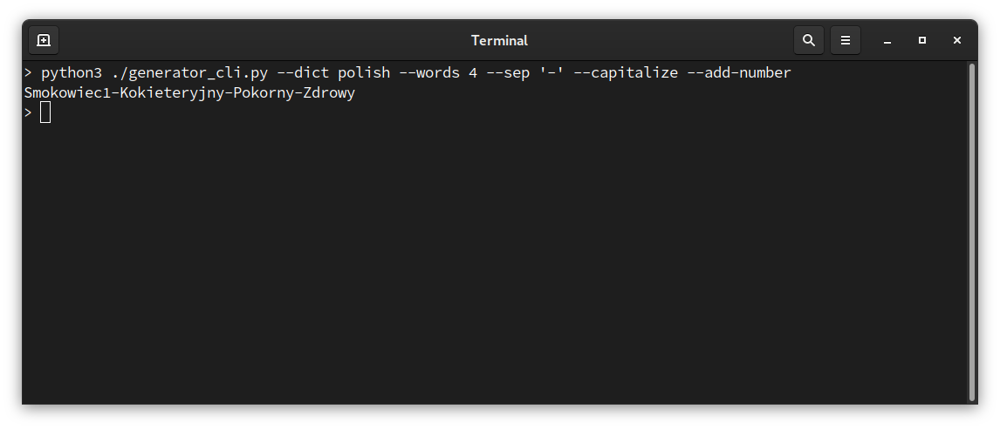

# word-password-generator

My attempt to make easy password generating software, that would be using previously-prepared wordlists (thus making it multilingual).  
App inspired by [XKCD #936](https://xkcd.com/936/) and needed by me, because there was only passphrases generators that use English dictionary*.

  
## how to use it
Open app containing folder in terminal and put `python3 ./generator_cli.py [PARAMETERS]`. Available parameters are described under `--help` menu (`python3 ./generator_cli.py --help`)  
  
  
    
***

\* Some days after starting project I found another GitHub repos with similar programs, but I still also wanted to learn Python, so I continued. 
